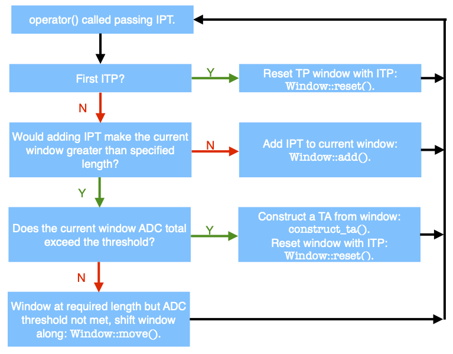

# ADCSimpleWindow

 - A “next-to-most-simple” triggering algorithm to exercise the TP chain.
 - Look at the total ADC of incoming TPs in a given time window (`window_length`), trigger if that total goes above some user defined threshold (`adc_threshold`). Both `window_length` and `adc_threshold` are configurable members of the `TriggerActivityMakerADCSimpleWindow` class. Defaults obtained based on the data in `tps_link_11.txt`.
 - All of the logic is implemented in the `TriggerActivityMakerADCSimpleWindow` class. A nested class called `Window` monitors incoming TPs (which are time ordered).
 - When a particular window exceeds threshold, `TriggerActivityMakerADCSimpleWindow::construct_ta()` constructs a `TriggerActivity`. This is enough (eventually) to request data to be read out. The `TriggerCandidateMakerADCSimpleWindow` class simply constructs trigger candidates one-for-one from the trigger activities.
 - Note that an activity will only be constructed once the window is full length even if the total ADC goes above the threshold beforehand. For example, if the user defines a window 1 ms in length and the ADC threshold is reached after 0.5 ms, a candidate will only be constructed once a TP is received with a start time 1 ms after the first TP in that window.
 - Can use `faketp_chain` confgen to generate the configuration to run the fake TP chain with the  `ADCSimpleWindow` algorithm:
 ```
python -m trigger.faketp_chain -a TriggerActivityMakerADCSimpleWindowPlugin -A "dict(window_length=100000,adc_threshold=1000000)" -c TriggerCandidateMakerADCSimpleWindowPlugin -f tps_link_11.txt faketp_chain_ADCSimpleWindow
```
 - Then to run:
```
python -m nanorc config_dir boot init conf start 1 resume wait 60 stop
```


## `Window`: `TriggerActivityMakerADCSimpleWindow` Nested Class:
 - Most of the logic is dealt with by the `Window` class, a class nested inside `TriggerActivityMakerADCSimpleWindow`.
 - It contains three member functions and five functions. `operator<<` is also defined. The following explanations can be used to interpret the accompanying flow chart.
  - `time_start`: Start time of the first TP chronologically in the window.
  - `adc_integral`: Total ADC of the TPs in the window.
  - `tp_list`: A vector of TPs in the window.
  - `is_empty()`: If the vector of TPs is empty, returns true, else false.
  - `clear()`: Clears the vector of TPs.
  - `move()`: Find all of the TPs in the current window which need to be removed if the input TP is to be added and the earliest and latest TPs in the window aren’t separated by more than `window_length`. The earliest TPs in the window are removed (their ADC contribution subtracted) until this condition is satisfied. `time_start` for the window is then set to what is now the first TP start time. Note that in the case that the input TP is further away than 1 `window_length` from the latest TP in the window, the window is reset with the input TP.
  - `reset():` Clear the TP list, restart the ADC sum, set the start time of the window to the start time of the input TP. Add, the input TP to the window TP list. 
  - `add()`: Add input TP to window TP list and its ADC to window ADC total. 

<p align="center">
  
</p>
